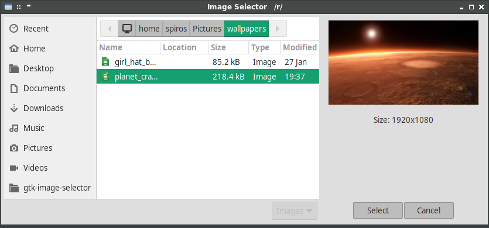
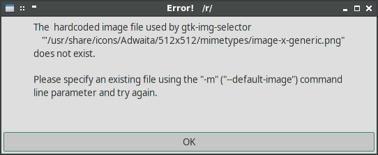
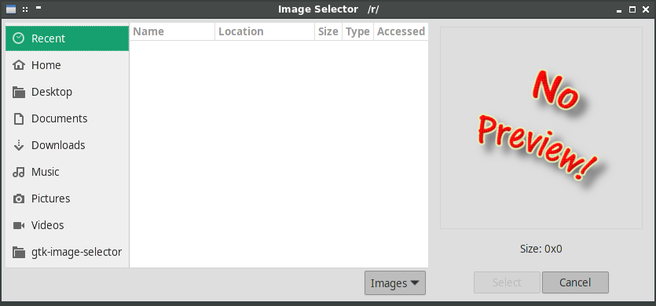
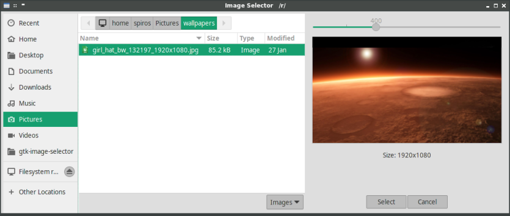

# gtk-image-selector




This is an attempt to restore Gtk Image Chooser "lost functionality": displaying an image preview when selecting images...

This is a simple python script; its only dependency is the `gobject` module.

When an image file is selected, its filename will be printed on `stdout`.

## How it all works

The script will read its parameters from 3 sources:

1. Hardcoded values
2. Configuration file(s)
3. Command line parameters

in this order.

It will display an image preview (either of the selected image or the default "*no preview*" image), and will exit when the "*Select*" button is clicked (or when "*Enter*" is pressed).

## Parameters

The following are the command line parameters:

    $ gtk-image-selector -h

```
usage: gtk-image-selector [-h] [-n] [-m DEFAULT_IMAGE] [-f FILE]
                          [-d DIRECTORY] [-p POSITION] [-r PREVIEW_SIZE] [-s]
                          [-i ICON] [-w WINDOW_TITLE] [-o OK_LABEL]
                          [-c CANCEL_LABEL] [-t FILTER_LABEL] [-l SIZE_LABEL]
                          [--dump-config]

A Gtk Image Chooser with Preview

optional arguments:
  -h, --help            show this help message and exit
  -n, --no-config       do not attempt to read any config file; just use the
                        command line parameters
  -m DEFAULT_IMAGE, --default-image DEFAULT_IMAGE
                        the image to display when no preview is available
                        (proposed size: 512x521)
  -f FILE, --file FILE  default file to select
  -d DIRECTORY, --directory DIRECTORY
                        default directory to show
  -p POSITION, --position POSITION
                        set window position, either as X,Y of "center"
  -r PREVIEW_SIZE, --preview-size PREVIEW_SIZE
                        set preview image size (100-1000)
  -s, --show-scale      show scale widget (hidden by default)
  -i ICON, --icon ICON  set window icon
  -w WINDOW_TITLE, --window_title WINDOW_TITLE
                        set window title
  -o OK_LABEL, --ok-label OK_LABEL
                        set OK button label
  -c CANCEL_LABEL, --cancel-label CANCEL_LABEL
                        set Cancel button label
  -t FILTER_LABEL, --filter-label FILTER_LABEL
                        set filter field label
  -l SIZE_LABEL, --size-label SIZE_LABEL
                        set size field label
  --dump-config         print a sample config file (can be saved to /etc/gtk-
                        image-selector.conf or ~/.config/gtk-image-
                        selector/config)
```

### The default image

When no image is selected, or the selected image is broken, **gtk-image-selector** will display its **default image** instead.

This image can be any valid image one can think of, but having a size of 512x512 or 256x265 (depending on **preview size** used).

**gtk-image-selector** will by default use "*image-x-generic.png*" of the "*Adwaita*" theme; when this is not found (and no other image is specified) the following message will appear and the script will terminate.




To use a different image, one would use the **-m** (**--default-image**) command line parameter. For example, using the "*no-preview.png*" file provided in this repo

    ./gtk-image-selector -m no-preview.png

would give this result.



Finally, the image can be specified in the configuratio file, parameter "**default_image**".

## Using a configuration file

**gtk-image-selector** can read two configuration files

1. /etc/gtk-image-selector.conf (system wide settings)
2. ~/.config/gtk-image-selector (user settings)

To see the default settings, just execute the command:

    $ gtk-image-selector --dump-config

which prints:

```
# the default folder to browse
folder =

# the default size of the image preview
preview_size = 256

# the image to show when no image file is selected
# or when the selected image is broken
# please make sure this image actually exists
default_image = /usr/share/icons/Adwaita/512x512/mimetypes/image-x-generic.png

# the icon to use as a window icon
icon = /usr/share/icons/Adwaita/16x16/mimetypes/image-x-generic.png

# set this to True to display the image scaling widget
show_scale = False

# window title and labels
window_title = Select an Image
ok_label = _Select
cancel_label = _Cancel
filter_label = Images
size_label = Size:

```

As you can see there are three types of settings:

- working settings (folder, preview_size, show_scale)
- icon and image settings (default_image, icon)
- localization settings (window_title, ok_label, etc.)

Combining these settings in the system wide config file and user config file and command line parameters, one can achieve various results.

## Using the scale widget

The application can display a scale widget, which will help you set the preview image size on the fly.

The scale widget is enabled using
- the **-s** (**--show-scale**) command line parameter, or
- the "**show_scale**" configuration option

In this case, the window will be as shown in the image below.



Please keep in mind that, changing the preview size will probably also change the window size, which is something that one has to get used to.
